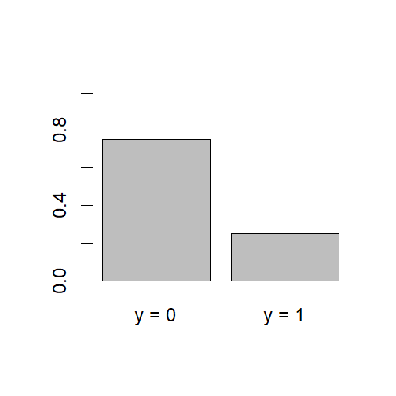
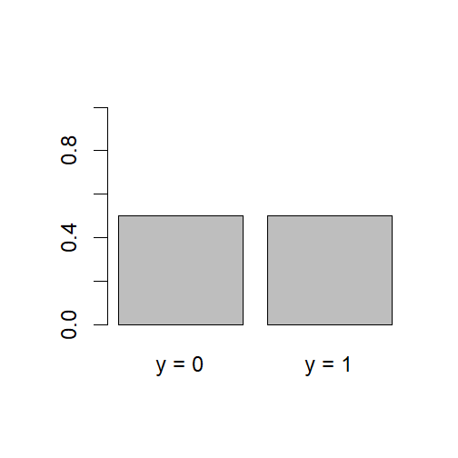
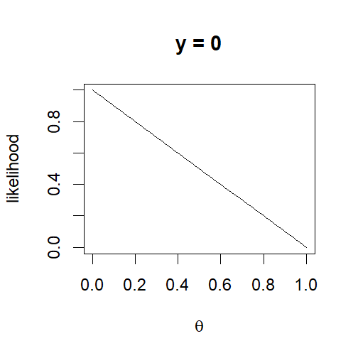
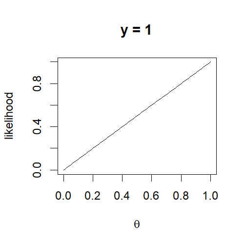
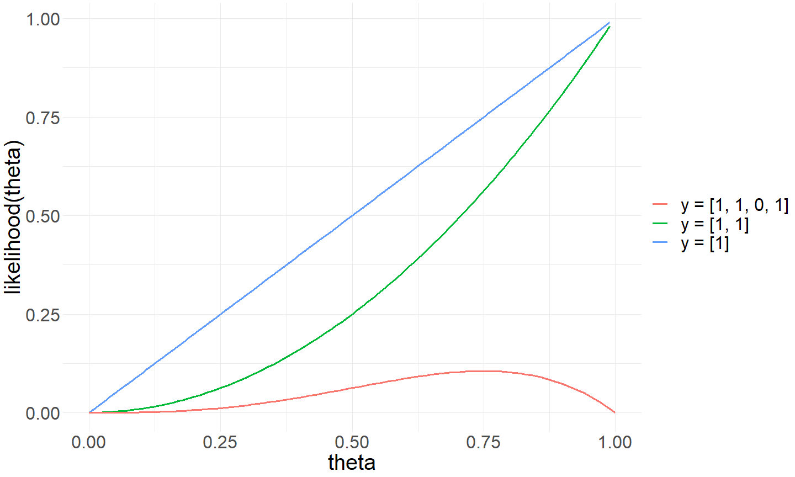
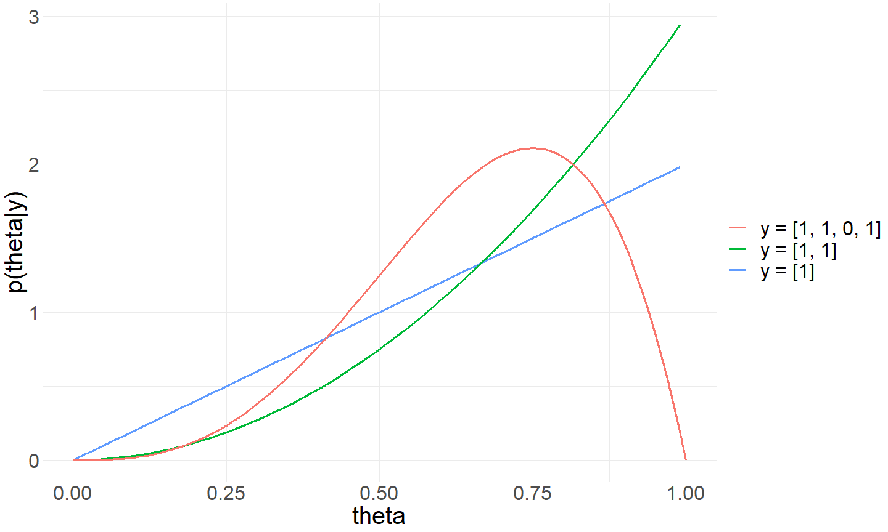
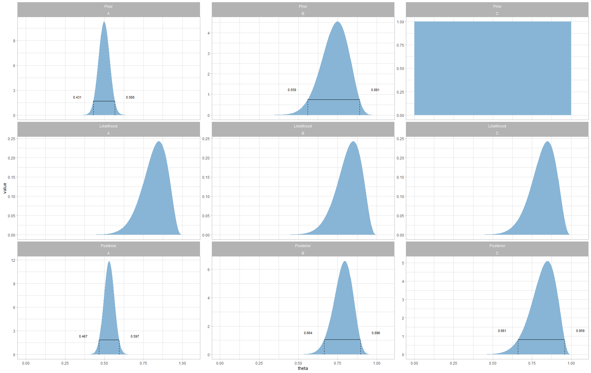

<style>
code {
  font-family: 'Fira Code Retina', Consolas !important;
}

.operator {
  font-variant-ligatures: common-ligatures !important;
}
</style>

ABDA: Assignment 3
========================================================
author: Fredrik Nyström
date:  October 2019
autosize: true
width: 1920
height: 1200

[Task A](#/TaskA)

[Task B](#/TaskB)

Task A
========================================================
id: TaskA
type: section

Task A.1
========================================================
left: 60%
Use Eq. 4.9 in Table 4.1 to calculate the conditional probability 
$\Pr(\textit{blue} \mid \textit{red} \cup \textit{blond})$

Eq. 4.9
$$\Pr(c \mid r) = \frac{\Pr(r,c)}{\sum_{c^*}\Pr(r, c^*)} = \frac{\Pr(r,c)}{\Pr(r)}$$

<center>  </center>

$$ \Pr(\textit{blue} \mid \textit{red} \cup \textit{blond}) = \frac{\color{steelblue}{Pr(\textit{red} \cup \textit{blond}, \textit{blue})}}{\color{olivedrab}{\Pr(\textit{red} \cup \textit{blond})}} = \\ \frac{0.03 + 0.16}{0.12 + 0.21} = 0.5757... $$

<i>The probability of an event is the <b>ratio of the number of cases</b> <span style="color:steelblue">favorable to it</span>, to the <span style="color:olivedrab">number of all cases possible</span> when nothing leads us to expect that any one of these cases should occur more than any other, which renders them, for us, equally possible.</i>

Task A.2
========================================================
left: 60%
incremental: true
Create a function that calculates the posterior probability of having or not having the disease given a sequential test result.

```r
probabilities <- function(prior = c(0.001, 0.999)) {
  probs <- matrix(
    nrow = 2, ncol = 2,
    dimnames = list(
      c("Positive", "Negative"), 
      c("Disease", "No Disease")
    )
  )
  hit_rate <- c(0.99, 0.05)
  probs["Positive",] <- hit_rate * prior
  probs["Negative",] <- (1 - hit_rate) * prior
  probs
}
```
***
<br/><br/>

```r
probabilities()
```

```
         Disease No Disease
Positive 0.00099    0.04995
Negative 0.00001    0.94905
```


Task A.2
========================================================
incremental: true


```r
posterior <- function(test_result = NULL, prior = c(0.001, 0.999)) {
  if (is.null(test_result)) return(prior)
  
  p <- probabilities(prior)

  c(
    "Disease"    = p[test_result, "Disease"]    / sum(p[test_result,]),
    "No Disease" = p[test_result, "No Disease"] / sum(p[test_result,])
  )
}
```

```r
posterior()
```

```
[1] 0.001 0.999
```

Task A.2
========================================================
incremental: true

```r
disease_with_test_results <- function(results) {
  post_prob <- posterior()

  for (result in results) {
    post_prob <- posterior(result, prior = post_prob)
  }
  post_prob
}
```


```r
disease_with_test_results(c("Positive", "Negative"))
```

```
     Disease   No Disease 
0.0002085862 0.9997914138 
```


```r
disease_with_test_results(c("Negative", "Positive"))
```

```
     Disease   No Disease 
0.0002085862 0.9997914138 
```


```r
disease_with_test_results(c("Positive", "Positive", "Positive", "Positive", "Negative"))
```

```
   Disease No Disease 
 0.6182427  0.3817573 
```

Task B
========================================================
id: TaskB
type: section


Task B.1
========================================================
Inferring the bias in a coin flip. The probability of each outcome is given by the Bernoulli distribution with discrete outcomes of $y = 0$ or $y = 1$ for a fixed $\theta$.

Probability mass function:

```r
bernoulli_pmf <- function(y, theta) {
  theta^y * (1 - theta)^(1 - y)
}
```

Helper function that returns a named vector of results for a given $\theta$.

```r
bernoulli_probability <- function(theta) {
  c(
    "y = 0" = bernoulli_pmf(y = 0, theta = theta), 
    "y = 1" = bernoulli_pmf(y = 1, theta = theta)
  )
}
```

```r
bernoulli_probability(theta = 0.4)
```

```
y = 0 y = 1 
  0.6   0.4 
```
Task B.2
========================================================
Plot the outcome probabilities given $\theta = 0.25$ and $\theta = 0.50$.

```r
barplot(bernoulli_probability(theta = 0.25), ylim = c(0, 1))
```


***

<br/>

```r
barplot(bernoulli_probability(theta = 0.50), ylim = c(0, 1))
```




Task B.3
========================================================
Plot the likelihood function for $y = 0$ and $y = 1$.


```r
plot(function(x) 
        bernoulli_pmf(y = 0, theta = x), 
     from = 0, to = 1, 
     xlab = expression(theta), 
     ylab = "likelihood", 
     main = "y = 0")
```


***
<br/>

```r
plot(function(x) 
        bernoulli_pmf(y = 1, theta = x), 
     from = 0, to = 1, 
     xlab = expression(theta), 
     ylab = "likelihood",
     main = "y = 1")
```


Task B.4a
========================================================
left: 50%
incremental: true
Implement equations 6.1 and 6.2.

```r
# 6.1
bernoulli_pmf <- function(y, theta) {
  theta^y * (1 - theta)^(1 - y)
}

#6.2
bernoulli_likelihood <- function(y, theta) {
  prod(bernoulli_pmf(y = y, theta = theta))
}
```
***
Create a vector of $n$ coin flips. Evaluate the likelihood function for $\theta$ for $n = {10, 1000, 100000}$. What happens for large values of $n$?


```r
bernoulli_likelihood(y = coin_toss(n = 10), 
                     theta = 0.5)
```

```
[1] 0.0009765625
```

```r
bernoulli_likelihood(y = coin_toss(n = 1e3), 
                     theta = 0.5)
```

```
[1] 9.332636e-302
```

```r
bernoulli_likelihood(y = coin_toss(n = 1e5), 
                     theta = 0.5)
```

```
[1] 0
```
Task B.4b&c
========================================================
left: 55%
incremental: true
Implement the logarithm versions of the pmf and the likelihood. Evaluate the log-likelihood for larger $n$ without problems of under- or overflow. Exponentiate the result.

```r
bernoulli_logpmf <- function(y, theta) {
  y*log(theta) + (1 - theta)*log(1 - theta)  
}

bernoulli_loglikelihood <- function(y, theta) {
  Y <- sum(y)
  n <- length(y)
  Y*log(theta) + (n - Y)*log(1 - theta)
}
```
***

```r
bernoulli_loglikelihood(y = coin_toss(n = 10), 
                        theta = 0.5)
```

```
[1] -6.931472
```

```r
bernoulli_loglikelihood(y = coin_toss(n = 1e3), 
                        theta = 0.5)
```

```
[1] -693.1472
```

```r
bernoulli_loglikelihood(y = coin_toss(n = 1e5), 
                        theta = 0.5)
```

```
[1] -69314.72
```

```r
c(exp(-6.9314), exp(-693.14), exp(-69314))
```

```
[1]  9.766326e-04 9.399891e-302  0.000000e+00
```
Task B.4d
========================================================
Plot the likelihood (exp-log) function with respect to $\theta \in \left[0, 1\right]$, given:
$$
y = [1] \\
y = [1, 1] \\
y = [1, 1, 0, 1]
$$


```r
likelihood <- function(y, theta) exp(bernoulli_loglikelihood(y, theta))

ggplot(data = data.frame(x = 0), aes(x = x)) + theme_minimal() + 
  xlim(0, 1) + xlab("theta") + ylab("likelihood(theta)") +
  stat_function(fun = likelihood, args = list(y = c(1)), size = 1.2, aes(color = "y = [1]")) + 
  stat_function(fun = likelihood, args = list(y = c(1,1)), size = 1.2, aes(color = "y = [1, 1]")) + 
  stat_function(fun = likelihood, args = list(y = c(1,1,0,1)), size = 1.2, aes(color = "y = [1, 1, 0, 1]")) 
```

Task B.4d&e
========================================================
left: 70%

***

- $y = [1]$
  - one trial with one success puts the most likelihood on $\theta = 1$ and zero likelihood on $\theta = 0$.
- $y = [1, 1]$
  - two trials with two successes gives a likelihood even more skewed towards $\theta = 1$.
- $y = [1, 1, 0, 1]$
  - four trials with three successes gives zero likelihood on $\theta = 1$ and a mode around $\theta = 0.75$.

Task B.5a
========================================================
Use the posterior distribution in 6.8 and make new plots for the data sets in B4a. 
$$
p(\theta \vert z, N) = \frac{\theta^{((z + a) - 1)}(1 - \theta)^{((N - z + b) - 1)}}{B(z + a, N - z + b)}
$$
with
$$
B(a,b) = \int_0^1{\theta^{(a-1)}(1-\theta)^{(b-1)}d\theta} = \frac{\Gamma(a)\Gamma(b)}{\Gamma(a+b)}
$$

```r
B <- function(a, b) {
  #integrate(f = function(theta) theta^(a - 1) * (1 - theta)^(b - 1), lower = 0, upper = 1)$value
  gamma(a) * gamma(b) / gamma(a + b)
}

posterior_beta <- function(theta, z, N) {
  a <- b <- 1
  exp(((z + a) - 1) * log(theta) + ((N - z + b) - 1) * log(1 - theta) - log(B(z + a, N - z + b)))
}
```
Task B.5a
========================================================

```r
ggplot(data = data.frame(x = 0), aes(x = x)) + theme_minimal() + 
  xlim(0, 1) + xlab("theta") + ylab("p(theta|y)") +
  stat_function(fun = posterior_beta, args = list(z = 1, N = 1), size = 1.2, aes(color = "y = [1]")) + 
  stat_function(fun = posterior_beta, args = list(z = 2, N = 2), size = 1.2, aes(color = "y = [1, 1]")) + 
  stat_function(fun = posterior_beta, args = list(z = 3, N = 4), size = 1.2, aes(color = "y = [1, 1, 0, 1]"))
```
Task B.5a
========================================================
left: 60%

***
ii 1) Difference between this figure and the previous likelihood figure ?
  - These functions are now true probability density functions as they integrate to unity.
ii 2) Compare the mathematical expression of likelihood with the posterior expression for $a=1$ and $b=1$.
$$
p(y \vert \theta) = \theta^y(1-\theta)^{(1-y)} \\
p(\{y_i\} \vert \theta) = \theta^z(1-\theta)^{(N-y)} \\
p(\theta \vert z,N) = \frac{\theta^{((z+a)-1)}(1-\theta)^{((N-z+b)-1)}}{B(z+a,N-z+b)}
$$

With $a = 1$ and $b = 1$:

$$
\frac{\theta^{z}(1-\theta)^{N-z}}{B(z+1,N-z+1)} 
$$

The only difference is the integral in the denominator which normalizes the posterior to unity, changing from a likelihood function to a probability density function.

Task B.5a iii
========================================================
Assume a more informative prior and reproduce Figure 6.4 in the book.

Function to generate the data for the figure.


```r
fig6.4_data <- function(a, b, col) {
  z <- 17
  N <- 20
  tibble(theta = seq(from = 0, to = 1, by = 0.001), column = col) %>% 
    mutate(
      prior      = dbeta(theta, shape1 = a, shape2 = b),
      likelihood = dbinom(x = z, size = N, prob = theta),
      posterior  = dbeta(theta, shape1 = z + a, shape2 = N - z + b)
    ) %>%
    pivot_longer(cols = prior:posterior, names_to = "distribution")
}
```
Task B.5a iii
========================================================
Function to calculate the HDI. *NB: Can't handle multiple HDI ranges*

```r
HDI <- function(.tbl, prob = 0.95) {
  HDI_range <- .tbl %>% arrange(desc(value)) %>%
    mutate(cumsum = cumsum(value)) %>%
    filter(cumsum < sum(value)*prob)
  
  min <-  HDI_range %>%
    filter(theta == min(theta)) %>%
    select(column, distribution, theta, value)
  
  max <- HDI_range %>%
    filter(theta == max(theta)) %>%
    select(column, distribution, theta, value)
  
  inner_join(min, max, by = c("column", "distribution"), suffix = c(".min", ".max"))
}
```
Task B.5a iii
========================================================

```r
# Specify the order
dist_lvls <- c("prior", "likelihood", "posterior")

# Calculate the columns
A <- fig6.4_data(a = 100, b = 100, col = "A")
B <- fig6.4_data(a = 18.25, b = 6.75, col = "B")
C <- fig6.4_data(a = 1, b = 1, col = "C")

# Calculate the HDIs
HDI_data <- rbind(
  A %>% filter(distribution == "prior")     %>% HDI, 
  A %>% filter(distribution == "posterior") %>% HDI,
  B %>% filter(distribution == "prior")     %>% HDI, 
  B %>% filter(distribution == "posterior") %>% HDI, 
  #C %>% filter(distribution == "prior")     %>% HDI, uniform
  C %>% filter(distribution == "posterior") %>% HDI 
) %>% 
  mutate(distribution = factor(distribution, levels = dist_lvls))

# Reorder the distributions
fig6.4 <- rbind(A, B, C) %>% 
  mutate(distribution = factor(distribution, levels = dist_lvls))
```

Task B.5a iii
========================================================
Plot the figure!

```r
ggplot(data = fig6.4, aes(x = theta)) + theme_light() + 
  geom_area(aes(y = value), fill = "#88b5d6") + 
  #HDI Line
  geom_segment(data = HDI_data, 
               aes(x = theta.min, y = value.min, xend = theta.max, yend = value.min)) +
  #HDI anchors
  geom_segment(data = HDI_data, 
               aes(x = theta.min, y = 0, xend = theta.min, yend = value.min), linetype = "dashed") +
  geom_segment(data = HDI_data, 
               aes(x = theta.max, y = 0, xend = theta.max, yend = value.min), linetype = "dashed") +
  geom_text(data = HDI_data, 
            aes(x = theta.min, y = value.min, label = theta.min), 
            nudge_y = 0.5, nudge_x = -0.1, size = 3) +
  geom_text(data = HDI_data, 
            aes(x = theta.max, y = value.min, label = theta.max), 
            nudge_y = 0.5, nudge_x = +0.1, size = 3) +
  facet_wrap(distribution ~ column, labeller = labeller(distribution = str_to_title), 
             scales = "free_y") 
```
Task B.5a iii
========================================================


