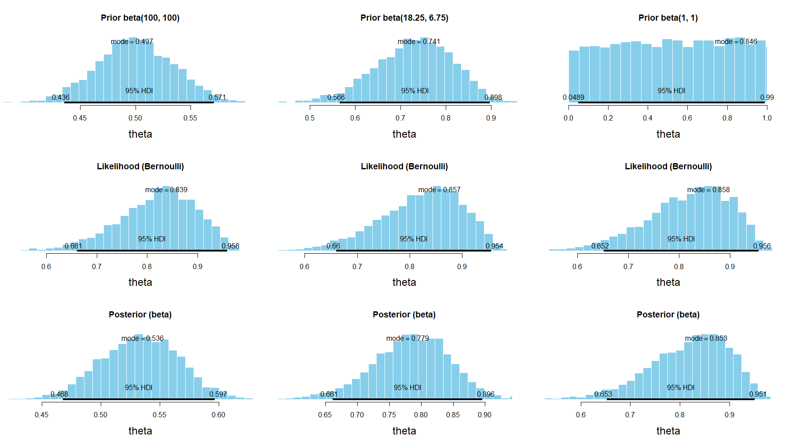

```{r setup, include=FALSE}
library(tidyverse)
library(rstan)
library(tictoc)
library(bayesboot)
library(bayestestR)
library(cowplot)
library(gridGraphics)
knitr::opts_chunk$set(echo = TRUE)

```
## Table of Contents

* [Task A.1](#a1)
  * [Slice sampler](#slicesampler)
* [Task A.2](#a2)
---
name: a1
## Task 1
Recreate Figure 6.4 using STAN and/or slice sampling.

 - Priors, beta(100, 100), beta(18.25, 6.75), beta(1, 1)
 - Bernoulli likelihood
 - Data, z = 17, N = 20

.center[]

---

## Stan model code: Prior & Likelihood

```{stan output.var = "prior", eval = FALSE}
// prior
parameters {
  real<lower = 0, upper = 1> theta;
}
model {
  theta ~ beta(`${a}`, `${b}`);
}
```

```{stan output.var = "likelihood", eval = FALSE}
// likelihood
data {
  int<lower = 0> N;
  int y[N];
}

parameters {
  real<lower = 0, upper = 1> theta;
}
model {
  y ~ bernoulli(theta);
}

```
---
## Stan model code: Posterior
```{stan output.var = "posterior", eval = FALSE}
// posterior
data {
  int<lower = 0> N;
  int y[N];
}

parameters {
  real<lower = 0, upper = 1> theta;
}

model {
  theta ~ beta(`${a}`, `${b}`);
  y ~ bernoulli(theta);
}
```


---
## String interpolation for prior parameters


```{r string_interpolation, eval=FALSE, include=TRUE}
# Specify the shape parameters for the beta priors, 
# used for string interpolation
beta_left   <- list(a = 100,   b = 100)
beta_middle <- list(a = 18.25, b = 6.75)
beta_right  <- list(a = 1,     b = 1)

# Prepare the prior code for each prior by string interpolation
left_prior_code   <- str_interp(prior_code, beta_left)
middle_prior_code <- str_interp(prior_code, beta_middle)
right_prior_code  <- str_interp(prior_code, beta_right)

# Prepare the posterior code for each prior by string interpolation
left_posterior_code   <- str_interp(posterior_code, beta_left)
middle_posterior_code <- str_interp(posterior_code, beta_middle)
right_posterior_code  <- str_interp(posterior_code, beta_right)
```

---
## The data

```{r the_data}
# Convenience function to convert the input data to the format 
# Stan expects
get_data <- function(ys) { list(y = ys, N = length(ys)) }

# Data for Figure 6.4. 
# z = 17 successes out of N = 20 trials 
y <- c(1, 1, 1, 1, 1, 1, 1, 1, 1, 1, 1, 1, 1, 1, 1, 1, 1, 0, 0, 0)
```
---
## Stan compilation
```{r stan_code, include = FALSE}
prior_code <- "
parameters {
  real<lower = 0, upper = 1> theta;
}
model {
  theta ~ beta(${a}, ${b});
}

"

likelihood_code <- "
data {
  int<lower = 0> N;
  int y[N];
}

parameters {
  real<lower = 0, upper = 1> theta;
}
model {
  y ~ bernoulli(theta);
}

"

posterior_code <- "
data {
  int<lower = 0> N;
  int y[N];
}

parameters {
  real<lower = 0, upper = 1> theta;
}

model {
  theta ~ beta(${a}, ${b});
  y ~ bernoulli(theta);
}

"
```

```{r stan_compilation, cache=TRUE, eval=FALSE}
# Compile the code. Sampling from the likelihood and the posterior needs the 
# data supplied as an argument
left_prior      <- stan(model_code = left_prior_code)
left_likelihood <- stan(model_code = likelihood_code, data = get_data(y))
left_posterior  <- stan(model_code = left_posterior_code, data = get_data(y))

middle_prior      <- stan(model_code = middle_prior_code)
middle_likelihood <- stan(model_code = likelihood_code, data = get_data(y))
middle_posterior  <- stan(model_code = middle_posterior_code, data = get_data(y))

right_prior      <- stan(model_code = right_prior_code)
right_likelihood <- stan(model_code = likelihood_code, data = get_data(y))
right_posterior  <- stan(model_code = right_posterior_code, data = get_data(y))
```
---
## Extract the posterior samples from the chains

```{r extract_samples_from_posterior, eval=FALSE}
# Extract samples from the chains
left_prior_samples      <- extract(left_prior)$theta
left_likelihood_samples <- extract(left_likelihood)$theta
left_posterior_samples  <- extract(left_posterior)$theta

middle_prior_samples      <- extract(middle_prior)$theta
middle_likelihood_samples <- extract(middle_likelihood)$theta
middle_posterior_samples  <- extract(middle_posterior)$theta

right_prior_samples      <- extract(right_prior)$theta
right_likelihood_samples <- extract(right_likelihood)$theta
right_posterior_samples  <- extract(right_posterior)$theta
```
---
## Construct the plots

```{r plot_construction, eval=FALSE}
left_prior_plot      <- ~plotPost(left_prior_samples, showMode = TRUE, cex = 1,
                                  main = "Prior beta(100, 100)", xlab = "theta")
left_likelihood_plot <- ~plotPost(left_likelihood_samples, showMode = TRUE, cex = 1,
                                  main = "Likelihood (Bernoulli)", xlab = "theta")
left_posterior_plot  <- ~plotPost(left_posterior_samples, showMode = TRUE, cex = 1,
                                  main = "Posterior (beta)", xlab = "theta")

middle_prior_plot      <- ~plotPost(middle_prior_samples, showMode = TRUE, cex = 1,
                                  main = "Prior beta(18.25, 6.75)", xlab = "theta")
middle_likelihood_plot <- ~plotPost(middle_likelihood_samples, showMode = TRUE, cex = 1,
                                  main = "Likelihood (Bernoulli)", xlab = "theta")
middle_posterior_plot  <- ~plotPost(middle_posterior_samples, showMode = TRUE, cex = 1,
                                  main = "Posterior (beta)", xlab = "theta")

right_prior_plot      <- ~plotPost(right_prior_samples, showMode = TRUE, cex = 1,
                                    main = "Prior beta(1, 1)", xlab = "theta")
right_likelihood_plot <- ~plotPost(right_likelihood_samples, showMode = TRUE, cex = 1,
                                    main = "Likelihood (Bernoulli)", xlab = "theta")
right_posterior_plot  <- ~plotPost(right_posterior_samples, showMode = TRUE, cex = 1,
                                    main = "Posterior (beta)", xlab = "theta")
```
---
## Arrange the plot in a grid

```{r plot_grid, eval=FALSE}
left   <- plot_grid(left_prior_plot, left_likelihood_plot, left_posterior_plot, ncol = 1)
middle <- plot_grid(middle_prior_plot, middle_likelihood_plot, middle_posterior_plot, ncol = 1)
right  <- plot_grid(right_prior_plot, right_likelihood_plot, right_posterior_plot, ncol = 1)

plot_grid(left, middle, right, ncol = 3)
```
---
## Recreated Figure 6.4 using MCMC with Stan

.center[]

---
name: slicesampler
## Slice sampler

.small[
```{r}
slice_sample <- function(f, x_0, w) {
  N <- length(x_0)
  x_1 <- vector(mode = "numeric", length = N)
  seq_dfrow <- function(df) { seq_len(nrow(df)) }
  # Step (a): Find the value of y that defines the slice
  y <- runif(n = 1, min = 0, max = f(x_0))
  # Step (b): Randomly position the hyperrectangle
  H <- data.frame(L = rep(NA, N), R = rep(NA, N))
  for (i in seq_dfrow(H)) {
    H[i, "L"] <- x_0[i] - runif(n = 1, min = 0, max = w[i])
    H[i, "R"] <- H[i, "L"] + w[i]
  }
  # Step (c): Sample from H, shrinking when points are rejected
  repeat {
    for (i in seq_along(x_1)) {
      x_1[i] <- H[i, "L"] + runif(n = 1) * (H[i, "R"] - H[i, "L"])
    }
    if (y < f(x_1)) break
    for (i in seq_dfrow(H)) {
      if (x_1[i] < x_0[i]) {
        H[i, "L"] <- x_1[i]
      } else {
        H[i, "R"] <- x_1[i]
      }
    }
  } 
  return(x_1)
}
```
]
---
## Slice sampler

```{r}
slice_sampling <- function(posterior, initial_point, scale_estimates, iter = 2000, warmup = floor(iter/2)) {
  chain_length <- iter - warmup
  samples <- data.frame(matrix(vector(), iter, length(initial_point)))
  
  samples[1,] <- slice_sample(f = posterior, x_0 = initial_point, w = scale_estimates)
  for (i in 2:iter) {
    samples[i, ] <- slice_sample(f = posterior, x_0 = unlist(samples[i - 1,]), w = scale_estimates)    
  }
  
  colnames(samples) <- paste0("param", seq_along(colnames(samples)))
  return(tail(samples, n = chain_length))
}
```
---
## Test of slice sampler

.pull-left[
```{r, cache=TRUE}
log_pdf <- function(x) {
  mu1 <- c(1, 2)
  mu2 <- c(-1, 2)
  C1 <- matrix(c(5, 5, 5, 10) , nrow = 2) / 10
  C2 <- matrix(c(10, -5, 5, 5), nrow = 2) / 10
  x1 <- x - mu1
  x2 <- x - mu2
  
  drop(
    log(
      0.5 * exp(-((x1 %*% solve(C1)) %*% x1)) + 
      0.5 * exp(-((x2 %*% solve(C2)) %*% x2))
  ))
}

pdf <- function(x) exp(log_pdf(x))


slice_it <- function() {
  slice_sampling(pdf, initial_point = c(1, 1), scale_estimates = c(1, 1), iter = 10000)
}
```
]

.pull-right[
```{r, fight.height=5}
slices <- slice_it()
slices %>% ggplot(aes(x = param1, y = param2)) + geom_density2d()
```

]

---
name: a2
## Task A.2

Given the following measurements $y = [1, 0, 1, 1, 0, 1, 1, 1, 0, 1, 1, 1 ,1 ,1]$. 

1. What is the probability of getting a head?
  Give a 95% credible interval of this probability.
2. What is the probability that $\theta > 0.5$ ?

--
```{stan, output.var = "TaskA21", cache = TRUE}
data {
  int<lower = 0> N;
  int y[N];
}

parameters {
  real<lower = 0, upper = 1> theta;
}

model {
  y ~ bernoulli(theta);
}

generated quantities {
  int prob05;
  prob05 = theta > 0.5; 
}

```
---
## Sampling from the MCMC
```{r, eval = FALSE}
y <- c(1, 0, 1, 1, 0, 1, 1, 1, 0, 1, 1, 1, 1, 1)
data <- list(y = y, N = length(y))

# Compile the stan model
model <- stan_model(file = model_file, model_name = "Task A.2")
samples <- sampling(model, data = data, iter = 12000)
```
```{r, include = FALSE, echo = FALSE, cache = TRUE}
y <- c(1, 0, 1, 1, 0, 1, 1, 1, 0, 1, 1, 1, 1, 1)
data <- list(y = y, N = length(y))
samples <- sampling(TaskA21, data = data, iter = 12000)
```

--
$\texttt{rstan}$ default is 4 chains, 2,000 iterations, including 1,000 warm-up. Increased to 12,000.
--


[p184]

*[...] for aspects of the distribution that are strongly influenced by sparse regions, such as the limits of the 95% HDI, the ESS needs to be relatively large. [...] One simple guideline is this: For reasonably accurate and stable estimates of the 95% HDI, an ESS of 10,000 is recommended.*
--
.center[
ESS went from ~= 1500 to 10000
]

---
## Summary from Stan
```{r}
samples
```
---
## Sampling $\theta$  from MCMC

```{r}
params <- rstan::extract(samples)
params <- as_tibble(params)
params
```
---
## Visualizing the posterior
```{r, fig.height=5}
params %>% ggplot(aes(x = theta)) + geom_histogram(binwidth = 0.01) + 
  geom_vline(xintercept = mean(params[["theta"]]), color = "blue") + 
  geom_vline(xintercept = map_estimate(params[["theta"]]), color = "green") + 
  geom_vline(xintercept = median(params[["theta"]]), color = "red")
```
---
## Expected probability of getting a head?

We know since Chapter 6 with a prior of beta(1, 1), bernoulli likelihood and data of z = 11, N = 14, that the posterior will be a beta(1+11, 1 + 14 - 11) = beta(12, 4).

Expected value of a beta distribution: $E[\theta] = \frac{a}{a+b}=0.75$


```{r}
mean(params[["theta"]])
```
Other estimators:
```{r}
map_estimate(params[["theta"]])
median(params[["theta"]])
```

---
## Give a 95% credible interval of this probability?
```{r}
hdi(params[["theta"]])
hdi(params[["theta"]], ci = 0.95)
```

89% CI is one of the conventions from another Bayesian textbook. Rationale is that 95% intervals are considered unstable with an effective sample size (ESS) of less than 10,000. 90% intervals are more stable. But the choice of x% is completely arbitrary, so why not use a prime number... 
---
## What is the probability that $\theta > 0.5$

```{stan output.var = "gq", eval = FALSE}
generated quantities {
  int prob05;
  prob05 = theta > 0.5; 
}
```

```{r}
glimpse(params["prob05"])
mean(params[["prob05"]])
sum(params[["theta"]] > 0.5)/length(params[["theta"]])
```
---
## Task A2.b: Additional measurement

Given an additional set of measurements $z = [1, 0, 0, 0, 0, 0, 0, 1, 1, 0]$, are $y$ and $z$ measurements from the same coin?

```{stan output.var = "a2b", cache = TRUE}
data {
  int<lower = 0> Ny;     int y[Ny];
  int<lower = 0> Nz;     int z[Nz];
}

parameters {
  real<lower = 0, upper = 1> theta_y;
  real<lower = 0, upper = 1> theta_z;
}

model {
  y ~ bernoulli(theta_y);
  z ~ bernoulli(theta_z);
}

generated quantities {
  int y_gr_z = theta_y > theta_z;
  real<lower = -1, upper = 1> d_theta = theta_y - theta_z;
}

```
---
## Sampling from the MCMC
```{r, eval = FALSE}
y <- c(1, 0, 1, 1, 0, 1, 1, 1, 0, 1, 1, 1, 1, 1)
z <- c(1, 0, 0, 0, 0, 0, 0, 1, 1, 0)
data <- list(
  y = y, Ny <- length(y),
  z = z, Nz <- length(z)
)

# Compile the stan model
model <- stan_model(file = model_file, model_name = "Task A.2")
samples <- sampling(model, data = data, iter = 12000)
```
```{r, include = FALSE, echo = FALSE, cache = TRUE}
y <- c(1, 0, 1, 1, 0, 1, 1, 1, 0, 1, 1, 1, 1, 1)
z <- c(1, 0, 0, 0, 0, 0, 0, 1, 1, 0)
data <- list(
  y = y, Ny <- length(y),
  z = z, Nz <- length(z)
)
samples <- sampling(a2b, data = data, iter = 12000)
```
---
## Summary from Stan
```{r}
samples
```
---
## Sampling from the MCMC
```{r}
params <- rstan::extract(samples)
```
```{r, include = FALSE}
params <- as_tibble(params)
```

1. Calculating the probability that $\theta_y > \theta_z$.
2. Creating a new variable $d\theta = \theta_y - \theta_z$, and calculating a 95% CI.
```{r}
mean(params[["y_gr_z"]])
hdi(params[["d_theta"]], ci = 0.95)
```
---
## Region of Practical Equivalence (ROPE)
Probability of being outside a *specific* range that can be considered *practically no effect*. The region of practical equivalence (ROPE). HDI or full posterior + ROPE decision rule. ROPE range often suggested to be -0.1 to +0.1 on a standardized parameter (cmp. Cohen effect size).

Reject or accept
* HDI - either outside or inside. If in the middle - unclear.
* full posterior - ROPE smaller than 2.5% or greater than 97.5%.

.pull-left[
```{r}
# full posterior ROPE
d_theta_rope <- rope(params[["d_theta"]], ci = 1)
d_theta_rope
```
]
.pull-right[
```{r, fig.height = 3.5}
plot(d_theta_rope) 
```
]
---
## Histogram of $p(d\theta \vert y,z)$
3) Plot a histogram of $p(d\theta \vert y,z)$. Is it beta distributed?

```{r, fig.height = 5, eval = FALSE}
d_theta_hdi <- hdi(params[["d_theta"]], ci = 0.95)
params %>% ggplot(aes(x = d_theta)) + geom_histogram(binwidth = 0.05) + 
  geom_segment(x = d_theta_hdi$CI_low, xend = d_theta_hdi$CI_high, y = 0, yend = 0, color = "blue", size = 2)
```

.pull-left[
```{r, fig.height = 4, echo = FALSE}
d_theta_hdi <- hdi(params[["d_theta"]], ci = 0.95)
params %>% ggplot(aes(x = d_theta)) + geom_histogram(binwidth = 0.05) + 
  geom_segment(x = d_theta_hdi$CI_low, xend = d_theta_hdi$CI_high, y = 0, yend = 0, color = "blue", size = 2)
```
]

.pull-right[
A beta distribution is defined on the interval $[0, 1]$. The distribution for $d\theta$ is not bounded on that interval, therefore it cannot be a beta distribution.
]
